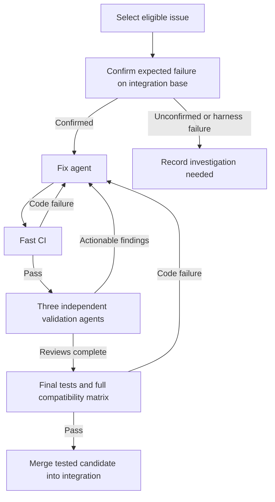

# Wholesale bug-fix plan

Status: canary rollout in progress. Frozen-test gates, gh-aw workers, and a
resumable controller are implemented. Integration and scale-up remain gated on
the canary's complete validation evidence.

Prepared: 2026-09-15.

The regression source is pinned to
`dd937719f7eee53c512f50ac604cab639bf42a4c` from
`codex/implement-regression-tests-for-all`. Fix workers use `gpt-6-astra` with
high reasoning; all three reviewers use `gpt-5.6-sol` with high reasoning.
Model fallback is disabled. See [worker runtime](Worker-runtime.md), the
[controller runbook](../../../.github/bugfix/README.md), and the
[canary log](Canary-log.md) for implementation details and rollout evidence.

## Objective

Reliably fix the confirmed open issue reports covered by this regression branch.
For every accepted fix, preserve evidence that the original regression fails on
the integration base, passes with the fix, and introduces no detected regressions
under the required validation. Use fast checks during repair and broader checks
before integration.

Use gh-aw for fix and validation agents. Ordinary GitHub Actions and a small,
deterministic controller own scheduling, evidence checks, retries, and merges.
Agent conclusions alone do not establish that an issue is fixed.

## Existing foundations and constraints

- The [open-bug inventory](../../open-bugs/README.md) and its
  [machine-readable mapping](../../open-bugs/inventory.json) distinguish current
  reproductions, intermittent defects, historical reproductions, and unconfirmed
  reports. Only eligible, confirmed current defects enter the automatic fix queue.
- Historical-only, documentation, publication, artifact, and unconfirmed reports
  need their own disposition; they must not be forced through a source-fix loop.
- The [September audit ledger](../../audits/2026-09/README.md) remains distinct
  from upstream issue reports. Source-context guards are not behavioral proof of
  a fix. An overlapping finding may supply context without becoming another issue.
- This branch intentionally contains hundreds of failing assertions. The gate
  must distinguish unresolved defects from newly introduced failures.
- [CI at dd937719](https://github.com/litedb-org/LiteDB/actions/runs/34965360583)
  took about 30 minutes across 112 jobs: 88 succeeded and 24 failed. The #2849
  performance repro took about 23 minutes on Windows. These are observations of
  that run, not timing guarantees or a classification of every failure.
- [ReproRunner](../../../LiteDB.ReproRunner/README.md) can succeed when a known
  defect reproduces. Its default `noRepro` expectation accepts a nonzero exit
  code. Automation needs stricter outcome classification before using it to
  approve fixes.
- Keep test-hook builds (`TestingEnabled=true`) separate from production builds
  (`TestingEnabled=false`). Preserve the repository's C# size checks and style.

## Workflow

The diagram shows the successful path and repair loop. Infrastructure errors,
inconclusive results, exhausted budgets, and missing evidence have explicit
non-success states. They never advance a candidate to acceptance.

Start with one active fix. After the pilot works, allow a few independent fixes
in parallel while serializing integration merges.

## 1. Define the test contract

Extend the existing inventory with execution metadata rather than creating a
second issue catalogue.

| Field | Purpose |
| --- | --- |
| Exact tests, repros, or scripts | Select all cases needed to establish the issue |
| Required environment | OS, actual process architecture, runtime, and historical version where needed |
| Expected defect outcome | Identify the assertion or explicit repro result |
| Control checks | Confirm valid inputs, persisted data, and recovery still work |
| Related suites | Choose broader checks for the affected behavior |
| Repetition policy | Define handling of intermittent and performance cases |
| Evidence references | Preserve baseline and candidate results |

Normalize execution into `bug_present`, `behavior_correct`, `harness_error`, or
`inconclusive`. Separate the process exit code from the behavioral verdict.

A build failure, missing fixture, empty test selection, or unrelated crash never
counts as evidence of a fix. A timeout counts as reproduction only when that
specific timeout is the established defect and the necessary controls succeeded.
Require explicit completion and control evidence for a correct-behavior verdict.

For each candidate:

1. Run the original regression against the pinned integration base.
2. Confirm the expected defect and successful controls.
3. Run the same regression against the candidate.
4. Require correct behavior and successful controls.

Keep the original regression, baseline ledger, and grading configuration outside
the fix agent's editable scope. Agents may add tests. Correcting an existing test
requires a separately reviewed change and renewed baseline evidence. Test patches
must not silently weaken the existing contract.

For intermittent issues, establish repeatability first. Prefer deterministic
scheduling or bounded fault injection where appropriate. Define repetitions and
success criteria before running the candidate; a few passing reruns do not prove
that an intermittent defect is fixed. Run performance comparisons without
competing benchmarks, and check correctness before interpreting timings.

## 2. Account for intentionally failing tests

Create a versioned expected-failure ledger from fresh baseline runs. Historical
suite totals are supporting evidence, not a substitute for the current baseline.

The acceptance rule is:

> The selected issue passes, every previously passing test still passes, and all
> remaining failures match explicitly recorded unresolved defects.

Match failures by test identity, parameterized case, environment, and failure
classification. Comparing failure counts is insufficient: one new failure can
replace one fixed failure without changing the total.

Reject newly skipped or missing tests, altered failure classifications, harness
errors, and regressions in previously fixed issues. Verify unexpected passes too:
a fix may resolve related reports, but their passing contracts must be confirmed
before promoting them permanently into the passing set.

Keep unresolved failures visible in reports while allowing the acceptance gate
to succeed when its precise contract is met. Do not blanket-ignore errors or
exclude the entire Issues folder. Remaining known failures continue to execute
at the applicable broader validation level.

## 3. Split CI into three levels

| Level | When | Work |
| --- | --- | --- |
| Focused | Every repair attempt | Selected regression, controls, nearby tests, C# size checks |
| Broad | Focused checks pass | Full ordinary .NET 8 suite against the ledger; additional required platforms |
| Acceptance | Reviews complete | Supported platform/framework checks, compatibility tests, relevant process and performance repros |

Focused CI should:

- Default to one Linux runner and .NET 8; use the required environment immediately
  for platform-specific defects.
- Build only necessary projects and frameworks; cache NuGet packages.
- Build once and execute without rebuilding.
- Keep outputs isolated by source revision, configuration, framework, and test-hook
  mode so that stale or production assemblies cannot satisfy test-hook checks.
- Reuse immutable historical-package baseline evidence when its source, test,
  dependency, and environment identities still match.
- Record actual selected and executed test cases; fail on zero or missing cases.

Target 2–5 minutes for ordinary focused checks, then measure pilot performance.
This is an initial target, not a promise for process, race, or performance repros.

Move expensive million-row performance runs into a dedicated lane. Require them
for relevant storage, indexing, safepoint, and performance changes; schedule them
periodically for the integration branch and include them in final promotion
validation. Select required lanes through reviewed rules based on the issue and
changed behavior, with a conservative fallback for unknown scope.

During the pilot, retain the full existing matrix before every integration merge.
Only reduce the acceptance subset after establishing reliable coverage. Ordinary
repair commits should trigger focused CI rather than the entire matrix.

Temporary user-authorized exception (2026-09-15): quarantine the three #2854
process jobs because the frozen fixture fails compilation before either variant
executes. Preserve the fixture source and its unverified issue status. Record
the exact excluded jobs and reason alongside every acceptance result; all other
original matrix jobs remain required. See the [canary log](Canary-log.md).

Verify that matrix labels describe actual execution. Add runtime-architecture
assertions for x86 and ARM64 coverage; a job name or QEMU setup alone does not
prove the test host uses that architecture.

## 4. Run three independent validators

Run each validator on the same frozen candidate in a separate workspace. Supply
the issue, diff, baseline evidence, and test results. Keep their initial reviews
independent so one review does not steer the others.

| Validator | Assignment |
| --- | --- |
| Behavior and test quality | Check the reported contract, boundary cases, alternate inputs, neighboring APIs, and whether tests can pass for the wrong reason |
| Storage and compatibility | Check older database files, v7 upgrade, ordinary v8 preservation, v9 vector promotion, encryption, read-only access, WAL replay, checkpoint, rollback, and reopen integrity |
| Regression and lifecycle | Check transactions, concurrency, disposal, cancellation, error paths, resource ownership, and relevant performance effects |

Each validator returns structured findings, inspected areas, evidence, and
proposed validation. Validators may contribute separate test patches for CI to
execute. Unexercised boundaries and inconclusive results must be explicit.

All three reviews must complete. This is not a majority vote: actionable findings
must be resolved, and missing reviews cannot count as approval. Preserve a
disposition and evidence for each finding, including findings determined not to
apply. Unresolved disagreement stops automatic acceptance.

Code changes invalidate prior approvals. Collected test additions become part of
the final candidate and test-definition revision; run the required checks against
that exact candidate. Renew review evidence after changes rather than carrying
approvals across unrelated commits.

Use the existing [vector compatibility script](../../../scripts/test-vector-compatibility.py)
as one component of validation. It does not establish every upgrade and recovery
contract. Apply the [vector compatibility rules](../../vector-query-compatibility.md)
and [transaction/WAL coverage](../../transaction-regression-coverage.md) as relevant.

## 5. Integrate the tested candidate

Seed `integration/bugfixes` from the agreed regression branch snapshot. Create
one branch per issue, such as `fix/issue-2874` or `fix/issue-2803`, based on a
recorded integration commit. Fix PRs target the integration branch.

For acceptance:

1. Acquire the integration merge lock.
2. Incorporate the latest integration state into the candidate.
3. Renew required review and CI evidence for that exact candidate.
4. Merge only if candidate and integration base remain unchanged.
5. Record the accepted issue and make its passing tests permanent requirements.

Implement the final branch update with an expected-current-base check. If the
base moves, recompute and revalidate; conflict-free Git merging does not establish
behavioral compatibility. Ensure the integrated tree is the tested tree, and
record the resulting integration commit.

Initially accept fixes individually. Other agents can keep working while one
candidate undergoes acceptance validation. Final promotion from integration to
the normal development branch requires the complete acceptance suite and an
explicit report of any remaining unresolved defects.

## 6. Implement gh-aw workers and deterministic orchestration

| Proposed component | Responsibility |
| --- | --- |
| `bugfix-controller.yml` and small Python modules | Queue selection, state transitions, dispatch, retries, and stale-result rejection |
| `bugfix-check.yml` | Baseline, focused, broad, and acceptance execution modes |
| `bugfix-fix.md` | Implement one issue's fix and produce a candidate through safe outputs |
| `bugfix-validate.md` | Run independently for each validator role |
| `bugfix-integrate.yml` | Verify complete evidence and merge the tested candidate |

Use the setup in `C:/Users/Jonas/repos/private/JKamsker/JKamsker.CodexSDK` as a
reference, particularly:

- `.github/workflows/codex-sdk-parity-pass.md`
- `.github/workflows/codex-sdk-parity-repair.yml`
- `.github/scripts/dispatch_parity_repair.py`
- `.github/scripts/compile_gh_aw.py`
- `docs/Runbooks/GhAwCustomEndpoint.md`

Reuse the fork pinning, compilation wrapper, endpoint handling, and bounded repair
pattern. Do not copy secret values into this repository or expose them in logs.
The inspected SDK lockfile pins `JKamsker/gh-aw` at `v0.82.0-jk.1`, commit
`21e402d7a4b5367258a7692cbb84fee60b507598`. The local checkout at
`C:/Users/Jonas/repos/external/gh-aw` was newer (`1cb529bed8`); deliberately select
and test one version rather than mixing compiler and runtime assumptions.

gh-aw provides [safe outputs](https://github.github.com/gh-aw/reference/safe-outputs/)
for PR changes and workflow dispatch. Keep scheduling and acceptance decisions
in the controller. Workers propose changes and return evidence; they cannot
rewrite acceptance policy or merge their own fixes.

Persist authoritative state in a controller-owned data branch with atomic updates.
Store detailed reports as run artifacts with sufficient retention for the
campaign. Preserve accepted evidence durably before temporary artifacts expire.
Treat labels and PR summaries as views of state, not the source of truth.

Each attempt records issue ID, integration base SHA, candidate SHA, test-definition
revision, environment identity, workflow and run IDs, attempt number, findings,
and result. Validate result provenance before consuming it. Missing artifacts or
unknown result schemas prevent acceptance. Do not reconstruct retry counts from
agent-written log text.

Initial operational limits:

- Three repair rounds, then record a blocked investigation with remaining evidence.
- Separate bounded infrastructure retries; do not spend code-repair attempts on
  runner or dependency-service outages.
- One active writer per issue and one integration merge at a time.
- A campaign-wide run/cost limit and an explicit pause control.
- Idempotent completion handling, stale-result rejection, and resumable state.

Use explicit dispatch for retries and downstream CI. GitHub limits `workflow_run`
chains to three levels, and automation-created PR events can require approval
before CI starts. These campaign workflows are registered upstream using a
limited push trigger on `automation/wholesale-bugfix`, then explicitly dispatched
from a pinned runtime branch. The repository's default branch is unchanged.
Keep controller code and policy at a trusted revision while checking out candidate
code separately for execution. These boundaries also prevent a candidate from
changing its own grader.

References: [workflow events](https://docs.github.com/en/actions/reference/workflows-and-actions/events-that-trigger-workflows#workflow_run)
and [workflow triggering](https://docs.github.com/en/actions/how-tos/write-workflows/choose-when-workflows-run/trigger-a-workflow).

## 7. Rollout and completion criteria

1. **Build the test gate:** exact selections, strict outcomes, fresh baseline
   ledger, and evidence artifacts.
2. **Test the gate itself:** demonstrate rejection of zero tests, unrelated
   crashes, weakened regressions, new skips, stale commits, missing reviewers,
   duplicate events, and moved integration bases. Verify retry bounds and resume
   behavior with controlled fixtures.
3. **Pilot #2874 manually through the workflow:** its argument-validation tests
   and valid-input controls offer a small, explicit starting point.
4. **Add the fix worker and three validators:** confirm evidence is tied to the
   final candidate, and that actionable reviewer feedback returns to repair.
5. **Pilot storage/recovery behavior, such as #2803:** exercise compatibility,
   persistence controls, and the broader acceptance lanes.
6. **Enable automatic integration:** first one issue at a time, then gradually
   increase parallel fix work while retaining serialized merges.
7. **Optimize measured bottlenecks:** reduce redundant builds and unnecessary
   matrix work only after the pilot demonstrates reliable coverage.

A pilot succeeds when it demonstrates a real baseline failure, a passing fixed
candidate, complete independent reviews, required acceptance checks, and an
integration update to the tested tree. Deliberately bad or incomplete evidence
must be rejected. Measure focused latency, acceptance latency, repair rounds,
review findings, and runner/agent cost before expanding the campaign.

Campaign completion means each scoped report has an explicit, evidence-backed
disposition. Confirmed eligible defects are fixed and validated; unconfirmed,
historical-only, external, and blocked reports remain honestly classified rather
than being counted as repaired. No finite test or review set proves absence of
all bugs; the workflow's guarantee is enforcement of its recorded evidence and
acceptance requirements.

## Recommended implementation order

Trustworthy test gate first, lightweight CI second, agent orchestration third.
This gives every worker a precise target and prevents workflow success from
being mistaken for proof of a validated fix.
