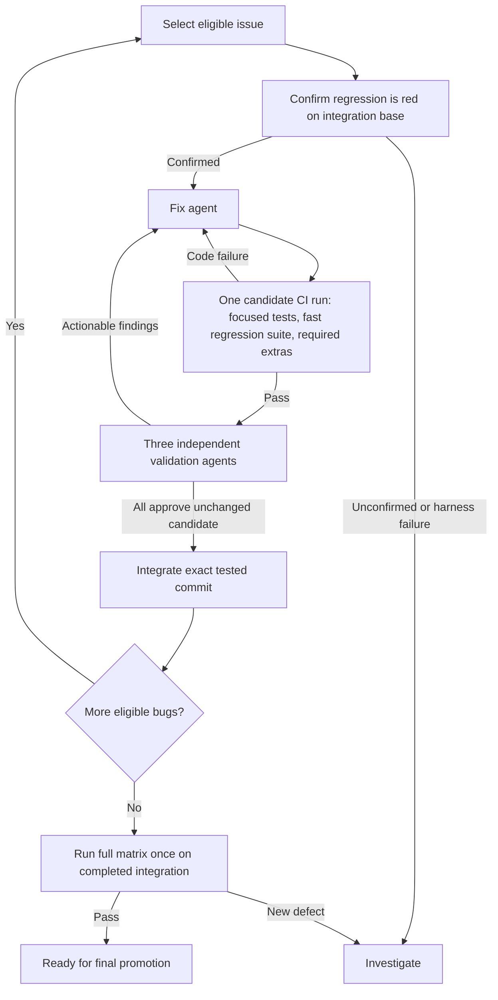

# Wholesale bug-fix plan

Status: #2874, #2839, #2869, and #1506 are integrated. The GitHub-hosted scheduler
bootstrap is deployed and enabled for `hosted-v10-main`: #1002 is active and 23
approved issues are pending. Both AI-credit limits are explicitly disabled for
fixers and reviewers, as requested after two capped v9 workers failed. The
reviewed v10 runtime is deployed, its fresh baseline passed, and the uncapped
fixer is executing. Candidate publication and validation remain pending.
Hosted state recovery, dispatch, red CI, pause/resume and scheduled quota handling
passed. The first hosted candidate publication/review/integration remains pending.
This replaces the local v8 queue that stopped at #1002.
An explicit #1002/#2811 co-repair contract is deployed; neither old #1002 candidate
is integrated. See the [agent handoff](HANDOFF.md) for the current deployment,
exact branches, evidence and continuation instructions. The queue enforces eighteen permanently passing cases. Accepted
candidate test lanes have taken 2m35s–2m48s, with production builds in parallel. Use one compressed
candidate CI run per repair attempt and run the expensive original matrix only
after the sweep. The acceptance profile, controller, and integration gate enforce
this split. See the [canary log](Canary-log.md) and [queue runbook](../../../.github/bugfix/QUEUE.md).

Prepared: 2026-09-15.

The regression source is pinned to
`dd937719f7eee53c512f50ac604cab639bf42a4c` from
`codex/implement-regression-tests-for-all`. Fix workers use `gpt-6-astra` with
high reasoning; all three reviewers use `gpt-5.6-sol` with high reasoning.
Model fallback is disabled. Workers pin Codex 0.154.0 and verify outgoing
high-reasoning requests before inference. See [worker runtime](Worker-runtime.md), the
[controller runbook](../../../.github/bugfix/README.md), and the
[canary log](Canary-log.md) for implementation details and rollout evidence.
Final-promotion full-matrix captures apply separately attested
[#2794 timing](Harness-2794.md) and [#2825 classifier](Harness-2825.md) corrections.
The frozen issue fixtures remain unchanged. Existing full runs are pilot
diagnostics; they are not a requirement for each integration merge.

## Objective

Reliably fix the confirmed open issue reports covered by this regression branch.
For every accepted fix, preserve evidence that the original regression fails on
the integration base, passes with the fix, and introduces no detected regressions
under the selected validation profile. Use a small CI gate for each candidate
and reserve the original platform/process/performance matrix for final promotion.

Use gh-aw for fix and validation agents. Ordinary GitHub Actions and a small,
deterministic controller own scheduling, evidence checks, retries, and merges.
Agent conclusions alone do not establish that an issue is fixed.

## Unattended operation

The sweep must run on GitHub without an open chat, local process or online user.
The [hosted runbook](HOSTED-SWEEP.md) defines deployment and recovery. Short
scheduled ticks and worker-completion wakeups resume a durable journal; they do
not wait inside one long-running CI job. Each tick uses an immutable reviewed
controller/runtime and a lease tied to the owning Actions run.

- Keep one active issue and three parallel review roles during this rollout.
- Preserve the exact pending request after interruptions; never blindly dispatch
  another copy or lose an unpublished candidate on a fresh runner.
- Retain blocked candidates and their review obligations. Continue independent
  approved issues; hold issues that share unresolved production scope.
- Apply automatic cooldown and retry for recoverable infrastructure and trusted
  usage-limit deferrals. An explicit operator pause remains an explicit pause.
- Publish durable progress on [tracking issue #2890](https://github.com/litedb-org/LiteDB/issues/2890).
- A queue containing deferred issues is not "all fixed." Final full-matrix
  validation remains a separate gate after the eligible sweep and dispositions.

The control-path canary verified separate Actions runners and automatic budget
handling. The approved queue is armed behind the unchanged #1002 campaign to
avoid an online batch handoff. The user's later September 16 instruction removed
both per-worker and daily AI-credit limits for this sweep, superseding the earlier
50,000 daily threshold. Usage reporting and all acceptance gates remain. See
[credit-limit removal](CREDIT-LIMIT-REMOVAL.md). Continue monitoring the
first complete candidate cycle before treating hosted fix integration as proven.
Further contract expansion or parallel candidate execution needs its own review.

## Existing foundations and constraints

- The [open-bug inventory](../../open-bugs/README.md) and its
  [machine-readable mapping](../../open-bugs/inventory.json) distinguish current
  reproductions, intermittent defects, historical reproductions, and unconfirmed
  reports. Only eligible, confirmed current defects enter the automatic fix queue.
- Historical-only, documentation, publication, artifact, and unconfirmed reports
  need their own disposition; they must not be forced through a source-fix loop.
- The [September audit ledger](../../audits/2026-09/README.md) remains distinct
  from upstream issue reports. Source-context guards are not behavioral proof of
  a fix. An overlapping finding may supply context without becoming another issue.
- This branch intentionally contains hundreds of failing assertions. The gate
  must distinguish unresolved defects from newly introduced failures.
- [CI at dd937719](https://github.com/litedb-org/LiteDB/actions/runs/34965360583)
  took about 30 minutes across 112 jobs: 88 succeeded and 24 failed. The #2849
  performance repro took about 23 minutes on Windows. These are observations of
  that run, not timing guarantees or a classification of every failure.
- [ReproRunner](../../../LiteDB.ReproRunner/README.md) can succeed when a known
  defect reproduces. Its default `noRepro` expectation accepts a nonzero exit
  code. Automation needs stricter outcome classification before using it to
  approve fixes.
- Keep test-hook builds (`TestingEnabled=true`) separate from production builds
  (`TestingEnabled=false`). Preserve the repository's C# size checks and style.

## Workflow

The diagram shows the successful path and repair loop. Infrastructure errors,
inconclusive results, exhausted budgets, and missing evidence have explicit
non-success states. They never advance a candidate to acceptance.

Start with one active fix and keep integration serialized. Parallel candidate
work is a later optimization; the hosted rollout does not enable it implicitly.

## 1. Define the test contract

Extend the existing inventory with execution metadata rather than creating a
second issue catalogue.

| Field | Purpose |
| --- | --- |
| Exact tests, repros, or scripts | Select all cases needed to establish the issue |
| Required environment | OS, actual process architecture, runtime, and historical version where needed |
| Expected defect outcome | Identify the assertion or explicit repro result |
| Control checks | Confirm valid inputs, persisted data, and recovery still work |
| Related suites | Choose broader checks for the affected behavior |
| Repetition policy | Define handling of intermittent and performance cases |
| Evidence references | Preserve baseline and candidate results |

Normalize execution into `bug_present`, `behavior_correct`, `harness_error`, or
`inconclusive`. Separate the process exit code from the behavioral verdict.

A build failure, missing fixture, empty test selection, or unrelated crash never
counts as evidence of a fix. A timeout counts as reproduction only when that
specific timeout is the established defect and the necessary controls succeeded.
Require explicit completion and control evidence for a correct-behavior verdict.

For each candidate:

1. Run the original regression against the pinned integration base.
2. Confirm the expected defect and successful controls.
3. Run the same regression against the candidate.
4. Require correct behavior and successful controls.

Keep the original regression, baseline ledger, and grading configuration outside
the fix agent's editable scope. Agents may add tests. Correcting an existing test
requires a separately reviewed change and renewed baseline evidence. Test patches
must not silently weaken the existing contract.

For intermittent issues, establish repeatability first. Prefer deterministic
scheduling or bounded fault injection where appropriate. Define repetitions and
success criteria before running the candidate; a few passing reruns do not prove
that an intermittent defect is fixed. Run performance comparisons without
competing benchmarks, and check correctness before interpreting timings.

## 2. Account for intentionally failing tests

Create a versioned expected-failure ledger from fresh baseline runs. Historical
suite totals are supporting evidence, not a substitute for the current baseline.

The acceptance rule is:

> The selected issue passes, every previously passing test still passes, and all
> remaining failures match explicitly recorded unresolved defects.

Match failures by test identity, parameterized case, environment, and failure
classification. Comparing failure counts is insufficient: one new failure can
replace one fixed failure without changing the total.

Reject newly skipped or missing tests, altered failure classifications, harness
errors, and regressions in previously fixed issues. Verify unexpected passes too:
a fix may resolve related reports, but their passing contracts must be confirmed
before promoting them permanently into the passing set.

Keep unresolved failures visible in reports while allowing the acceptance gate
to succeed when its precise contract is met. Do not blanket-ignore errors or
exclude the entire Issues folder. Remaining known failures continue to execute
at the applicable broader validation level.

## 3. Compress CI during the sweep

| Gate | When | Work |
| --- | --- | --- |
| Baseline | Before the first fix attempt for an issue/base | Original selected regressions and controls; confirm the expected red result |
| Candidate | Once per changed candidate | Focused checks first, then the fast ordinary regression suite against the ledger, production compile, and only profile-required extras |
| Final promotion | After the entire sweep | Original full platform/framework/process/performance matrix against every accepted issue and the remaining failure ledger |

The candidate workflow already runs focused checks before the broader ordinary
suite. Do not dispatch a separate focused workflow and rebuild the same candidate
again for broad CI. Three reviews follow a green candidate run. If the candidate
is unchanged, their approval goes directly to integration; no redundant
post-review acceptance rerun is needed.

The trusted controller derives a versioned acceptance profile from the issue
contract and exact production diff. Workers cannot choose or shrink it:

- Ordinary reviewed API fixes use Ubuntu/.NET 8, the focused regressions and
  controls, the fast ordinary suite, and a production build.
- Storage, serialization, WAL, encryption, upgrade, and vector changes add
  relevant compatibility checks and related tests.
- Platform or runtime-sensitive changes add the required OS/framework lanes.
- Unknown scope uses a conservative ordinary-test platform profile and
  compatibility checks; it does not automatically schedule the long process or
  performance matrix.
- Expensive targeted repros are required only when they establish the selected
  issue's contract. A performance bug may need its specific performance test;
  unrelated fixes do not run every historical benchmark.

Record the profile, rule version, selected lanes, reasons, and source SHAs with
CI evidence. All required tests must actually execute. Extra test filters should
not rerun cases already covered by the same ordinary-suite execution.

Candidate CI should:

- Default to one Linux runner and .NET 8; use the required environment immediately
  for platform-specific defects.
- Build only necessary projects and frameworks; cache NuGet packages.
- Build once and execute without rebuilding.
- Keep outputs isolated by source revision, configuration, framework, and test-hook
  mode so that stale or production assemblies cannot satisfy test-hook checks.
- Reuse immutable historical-package baseline evidence when its source, test,
  dependency, and environment identities still match.
- Record actual selected and executed test cases; fail on zero or missing cases.

Target 2–5 minutes for an ordinary candidate check, then measure pilot performance.
This is an initial target, not a promise for process, race, or performance repros.

Keep expensive million-row performance runs out of ordinary repair checks. Run
a specific performance repro during repair only when the selected issue needs
it to establish red-to-green behavior; include the complete set in final
promotion validation. Record such requirements in the reviewed issue contract.

Run the original full matrix once after the sweep, before promotion from the
integration branch. Completed pilot captures help diagnose harness problems but
are not repeated per fix. Do not launch fresh full matrices for grading-policy
or historical-harness corrections during the sweep. A genuinely new defect found
by final validation returns to the repair process and requires renewed relevant
evidence before final promotion.

Temporary user-authorized exception (2026-09-15): quarantine the three #2854
process jobs because the frozen fixture fails compilation before either variant
executes. Preserve the fixture source and its unverified issue status. Record
the exact excluded jobs and reason alongside every acceptance result; all other
original matrix jobs remain required at final promotion. See the [canary log](Canary-log.md).

Verify that matrix labels describe actual execution. Add runtime-architecture
assertions for x86 and ARM64 coverage; a job name or QEMU setup alone does not
prove the test host uses that architecture.

## 4. Run three independent validators

Run each validator on the same frozen candidate in a separate workspace. Supply
the issue, diff, baseline evidence, and test results. Keep their initial reviews
independent so one review does not steer the others.

| Validator | Assignment |
| --- | --- |
| Behavior and test quality | Check the reported contract, boundary cases, alternate inputs, neighboring APIs, and whether tests can pass for the wrong reason |
| Storage and compatibility | Check older database files, v7 upgrade, ordinary v8 preservation, v9 vector promotion, encryption, read-only access, WAL replay, checkpoint, rollback, and reopen integrity |
| Regression and lifecycle | Check transactions, concurrency, disposal, cancellation, error paths, resource ownership, and relevant performance effects |

Each validator returns structured findings with severity, inspected areas and
concrete evidence. They can run additional scratch checks outside the repository;
the original frozen tests remain unchanged. Unexercised required boundaries and
inconclusive results must be explicit.

All three reviews must complete. A candidate is done when required CI passes and
all reviewers approve with no findings or only cosmetic nits. Keep nits in the
authenticated review artifacts, without another candidate or CI run. Even a small
correctness, compatibility, reliability or performance defect is above nit severity.
Missing required evidence remains inconclusive and blocks acceptance.

If any reviewer finds something more severe than a nit, fix all findings from all
three reviewers, including nits from otherwise approving reviewers. The next
reviewers receive the exact prior feedback and must verify each required fix.
Prior obligations survive an intervening compile or CI failure; they are not
silently dropped. Unclassified legacy findings never receive a nit disposition.
Oversized complete feedback blocks explicitly instead of truncating findings.

Code changes require the changed candidate's compressed CI and three fresh
independent reviews. A prior required fix still left unresolved cannot pass as a
new optional nit. Preserve dispositions and evidence; unresolved disagreement
or a missing review blocks automatic acceptance.

Use the existing [vector compatibility script](../../../scripts/test-vector-compatibility.py)
as one component of validation. It does not establish every upgrade and recovery
contract. Apply the [vector compatibility rules](../../vector-query-compatibility.md)
and [transaction/WAL coverage](../../transaction-regression-coverage.md) as relevant.

## 5. Integrate the tested candidate

Seed `integration/bugfixes` from the agreed regression branch snapshot. Create
one branch per issue, such as `fix/issue-2874` or `fix/issue-2803`, based on a
recorded integration commit. Fix PRs target the integration branch.

For each integration merge:

1. Verify the exact candidate completed its selected CI profile and all three reviews.
2. Acquire the integration merge lock and require the recorded base to remain current.
3. If the base moved, incorporate it and renew CI/review evidence for the new commit.
4. Integrate only the tested commit, without rerunning unchanged evidence.
5. Record the accepted issue and make its passing tests permanent requirements.

The per-fix integration command does not require original full-matrix run IDs.
A separate final-promotion gate verifies the completed integration SHA, the
accepted ledger for all fixed issues, and the final full matrix. It must handle
all accepted fixes together rather than treating other fixed issues as unexpected
passes in a single-issue comparison.

Implement the final branch update with an expected-current-base check. If the
base moves, recompute and revalidate; conflict-free Git merging does not establish
behavioral compatibility. Ensure the integrated tree is the tested tree, and
record the resulting integration commit.

Initially accept fixes individually. Other agents can keep working while one
candidate undergoes acceptance validation. Final promotion from integration to
the normal development branch requires the complete acceptance suite and an
explicit report of any remaining unresolved defects.

## 6. Implement gh-aw workers and deterministic orchestration

| Proposed component | Responsibility |
| --- | --- |
| `bugfix-controller.yml` and small Python modules | Queue selection, state transitions, dispatch, retries, and stale-result rejection |
| `bugfix-check.yml` | Baseline and combined candidate profile; legacy acceptance for audited canary revalidation |
| `bugfix-fix.md` | Implement one issue's fix and produce a candidate through safe outputs |
| `bugfix-validate.md` | Run independently for each validator role |
| `.github/bugfix/integrate.py` | Verify per-fix profile and reviews, then integrate the exact tested commit |
| Final-promotion validator | Compare the completed sweep against all accepted contracts and the full matrix |

Use the setup in `C:/Users/Jonas/repos/private/JKamsker/JKamsker.CodexSDK` as a
reference, particularly:

- `.github/workflows/codex-sdk-parity-pass.md`
- `.github/workflows/codex-sdk-parity-repair.yml`
- `.github/scripts/dispatch_parity_repair.py`
- `.github/scripts/compile_gh_aw.py`
- `docs/Runbooks/GhAwCustomEndpoint.md`

Reuse the fork pinning, compilation wrapper, endpoint handling, and bounded repair
pattern. Do not copy secret values into this repository or expose them in logs.
The inspected SDK lockfile pins `JKamsker/gh-aw` at `v0.82.0-jk.1`, commit
`21e402d7a4b5367258a7692cbb84fee60b507598`. The local checkout at
`C:/Users/Jonas/repos/external/gh-aw` was newer (`1cb529bed8`); deliberately select
and test one version rather than mixing compiler and runtime assumptions.

gh-aw provides [safe outputs](https://github.github.com/gh-aw/reference/safe-outputs/)
for PR changes and workflow dispatch. Keep scheduling and acceptance decisions
in the controller. Workers propose changes and return evidence; they cannot
rewrite acceptance policy or merge their own fixes.

Persist authoritative state in a controller-owned data branch with atomic updates.
Store detailed reports as run artifacts with sufficient retention for the
campaign. Preserve accepted evidence durably before temporary artifacts expire.
Treat labels and PR summaries as views of state, not the source of truth.

Each attempt records issue ID, integration base SHA, candidate SHA, test-definition
revision, environment identity, workflow and run IDs, attempt number, findings,
and result. Validate result provenance before consuming it. Missing artifacts or
unknown result schemas prevent acceptance. Do not reconstruct retry counts from
agent-written log text.

Initial operational limits:

- Three repair rounds, then record a blocked investigation with remaining evidence.
- Separate bounded infrastructure retries; do not spend code-repair attempts on
  runner or dependency-service outages.
- One active writer per issue and one integration merge at a time.
- A campaign-wide run/cost limit and an explicit pause control.
- Idempotent completion handling, stale-result rejection, and resumable state.

Use explicit dispatch for retries and downstream CI. GitHub limits `workflow_run`
chains to three levels, and automation-created PR events can require approval
before CI starts. These campaign workflows are registered upstream using a
limited push trigger on `automation/wholesale-bugfix`, then explicitly dispatched
from a pinned runtime branch. The repository's default branch is unchanged.
Keep controller code and policy at a trusted revision while checking out candidate
code separately for execution. These boundaries also prevent a candidate from
changing its own grader.

References: [workflow events](https://docs.github.com/en/actions/reference/workflows-and-actions/events-that-trigger-workflows#workflow_run)
and [workflow triggering](https://docs.github.com/en/actions/how-tos/write-workflows/choose-when-workflows-run/trigger-a-workflow).

## 7. Rollout and completion criteria

1. **Build the test gate:** exact selections, strict outcomes, fresh baseline
   ledger, and evidence artifacts.
2. **Test the gate itself:** demonstrate rejection of zero tests, unrelated
   crashes, weakened regressions, new skips, stale commits, missing reviewers,
   duplicate events, and moved integration bases. Verify retry bounds and resume
   behavior with controlled fixtures.
3. **Pilot #2874 manually through the workflow:** its argument-validation tests
   and valid-input controls offer a small, explicit starting point.
4. **Add the fix worker and three validators:** confirm evidence is tied to the
   final candidate, and that actionable reviewer feedback returns to repair.
5. **Scale with #2839 and #2869:** use the prepared frozen contracts, then add
   storage/recovery issues with their selected compatibility requirements.
6. **Enable automatic integration:** first one issue at a time, then gradually
   increase parallel fix work while retaining serialized merges.
7. **Measure the compressed path:** one candidate CI run per attempt, no unchanged
   post-review rerun, and no full matrix until the sweep is complete.
8. **Validate final promotion:** run the full pipeline against the complete
   accepted-issue ledger and preserve its exact source and harness provenance.

A pilot succeeds when it demonstrates a real baseline failure, a passing fixed
candidate, complete independent reviews, required acceptance checks, and an
integration update to the tested tree. Deliberately bad or incomplete evidence
must be rejected. Measure focused latency, acceptance latency, repair rounds,
review findings, and runner/agent cost before expanding the campaign.

Campaign completion means each scoped report has an explicit, evidence-backed
disposition. Confirmed eligible defects are fixed and validated; unconfirmed,
historical-only, external, and blocked reports remain honestly classified rather
than being counted as repaired. No finite test or review set proves absence of
all bugs; the workflow's guarantee is enforcement of its recorded evidence and
acceptance requirements.

## Recommended implementation order

Trustworthy test gate first, lightweight CI second, agent orchestration third.
This gives every worker a precise target and prevents workflow success from
being mistaken for proof of a validated fix.
